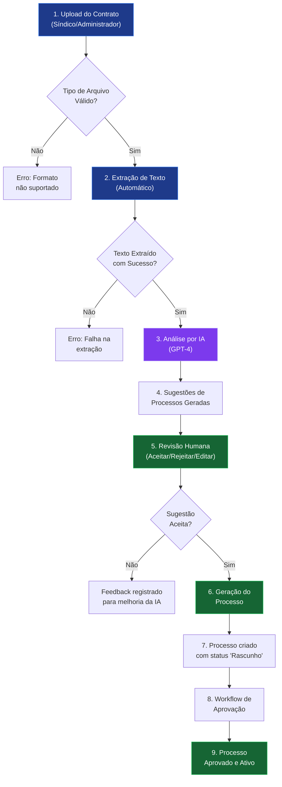
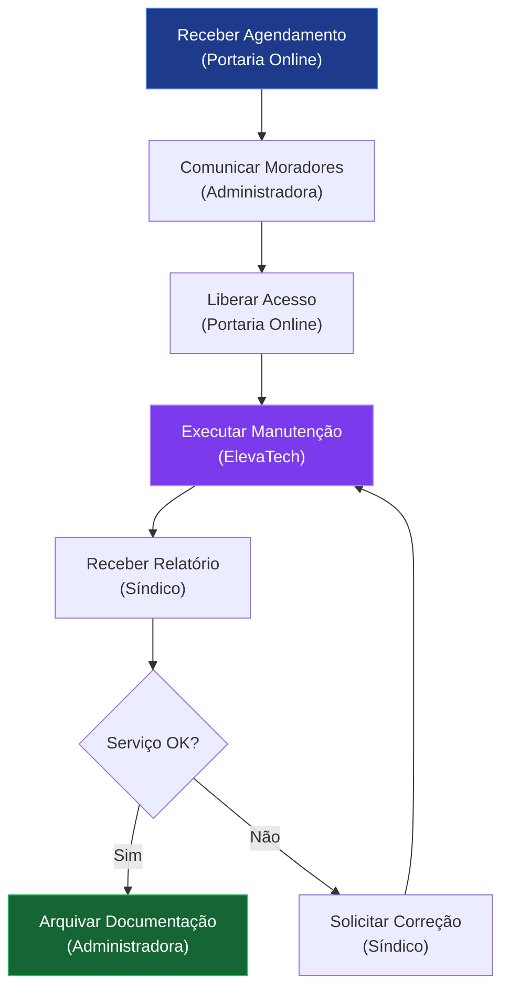

# Sistema de Ingestão de Contratos de Fornecedores

## Descrição Funcional Detalhada

**Versão**: 1.0  
**Data**: 2024-12-09

---

## 1. Visão Geral do Sistema

O **Sistema de Ingestão de Contratos de Fornecedores** é uma solução inteligente que automatiza a criação de processos operacionais a partir de contratos de prestadores de serviço. Utilizando Inteligência Artificial (IA), o sistema lê, interpreta e transforma contratos em processos documentados, prontos para serem aprovados e utilizados na gestão do condomínio.

### 1.1 Problema Resolvido

Atualmente, quando um novo fornecedor é contratado (empresa de limpeza, manutenção de elevadores, segurança, etc.), a equipe de gestão precisa:

1. Ler manualmente o contrato
2. Identificar quais serviços serão prestados
3. Criar manualmente os processos operacionais
4. Definir responsabilidades (quem faz o quê)
5. Documentar o fluxo de trabalho
6. Submeter para aprovação

**Este processo manual leva horas ou dias e está sujeito a erros e inconsistências.**

### 1.2 Solução Proposta

O sistema automatiza todo esse fluxo:

```
┌──────────────┐    ┌──────────────┐    ┌──────────────┐    ┌──────────────┐
│   UPLOAD     │    │   ANÁLISE    │    │   REVISÃO    │    │   GERAÇÃO    │
│   Contrato   │ -> │   por IA     │ -> │   Humana     │ -> │   Processo   │
│   (PDF/DOC)  │    │   (GPT-4)    │    │   (Ajustes)  │    │   Aprovação  │
└──────────────┘    └──────────────┘    └──────────────┘    └──────────────┘
     ~1 min              ~2 min              ~5 min              Automático
```

**Tempo total estimado: 8-10 minutos** (vs. horas no processo manual)

---

## 2. Fluxo Funcional Completo

### 2.1 Diagrama do Fluxo Principal



---

## 3. Funcionalidades Detalhadas

### 3.1 Upload de Contrato

#### O que é
Tela onde o usuário faz upload do arquivo de contrato do fornecedor.

#### Como funciona

1. **Acesso**: Menu lateral → Contratos → Novo Contrato
2. **Ação**: Arrastar arquivo ou clicar para selecionar
3. **Formatos aceitos**: PDF, DOC, DOCX
4. **Tamanho máximo**: 50 MB

#### Campos do formulário

| Campo | Obrigatório | Descrição |
|-------|-------------|-----------|
| Arquivo | Sim | Documento do contrato |
| Número do Contrato | Não | Identificador do contrato |
| Tipo de Contrato | Não | Serviço, Manutenção, Fornecimento, Terceirização |
| Nome do Fornecedor | Não | Será inferido pela IA se não informado |
| Data de Início | Não | Vigência do contrato |
| Data de Término | Não | Fim da vigência |

#### Exemplo de tela

```
┌─────────────────────────────────────────────────────────────────┐
│  Novo Contrato                                              [X] │
├─────────────────────────────────────────────────────────────────┤
│                                                                 │
│  ┌─────────────────────────────────────────────────────────┐   │
│  │                                                         │   │
│  │     📄 Arraste o arquivo aqui ou clique para            │   │
│  │        selecionar                                       │   │
│  │                                                         │   │
│  │     Formatos: PDF, DOC, DOCX (máx. 50MB)               │   │
│  │                                                         │   │
│  └─────────────────────────────────────────────────────────┘   │
│                                                                 │
│  Número do Contrato (opcional)                                 │
│  ┌─────────────────────────────────────────────────────────┐   │
│  │ CT-2024-0045                                            │   │
│  └─────────────────────────────────────────────────────────┘   │
│                                                                 │
│  Tipo de Contrato                                              │
│  ┌─────────────────────────────────────────────────────────┐   │
│  │ Serviço                                             [▼] │   │
│  └─────────────────────────────────────────────────────────┘   │
│                                                                 │
│  Nome do Fornecedor (opcional - será inferido pela IA)         │
│  ┌─────────────────────────────────────────────────────────┐   │
│  │                                                         │   │
│  └─────────────────────────────────────────────────────────┘   │
│                                                                 │
│                                    [Cancelar]  [📤 Enviar]     │
└─────────────────────────────────────────────────────────────────┘
```

#### O que acontece após o upload

1. Arquivo é salvo no servidor (S3/storage)
2. Sistema inicia extração de texto automaticamente
3. Usuário vê barra de progresso
4. Ao concluir, botão "Analisar com IA" fica disponível

---

### 3.2 Extração de Texto

#### O que é
Processo automático que converte o documento em texto legível pela IA.

#### Como funciona

| Formato | Tecnologia | Capacidade |
|---------|------------|------------|
| PDF | pdfplumber | Texto, tabelas, múltiplas páginas |
| PDF (escaneado) | OCR básico | Texto simples |
| DOC/DOCX | python-docx | Texto, formatação preservada |

#### Metadados extraídos

- Número de páginas
- Número de palavras
- Data de criação do documento
- Autor (se disponível)

#### Status possíveis

| Status | Descrição |
|--------|-----------|
| `extracting` | Extração em andamento |
| `extracted` | Texto extraído com sucesso |
| `error` | Falha na extração (arquivo corrompido, protegido, etc.) |

---

### 3.3 Análise por Inteligência Artificial

#### O que é
O coração do sistema. A IA lê o texto do contrato e identifica automaticamente:

1. **Quem é o fornecedor** (nome, tipo, CNPJ)
2. **Quais serviços serão prestados**
3. **Quais processos operacionais são necessários**
4. **Quem são os responsáveis por cada etapa**

#### Como funciona internamente

```
┌─────────────────────────────────────────────────────────────────┐
│                        ANÁLISE POR IA                           │
├─────────────────────────────────────────────────────────────────┤
│                                                                 │
│  ENTRADA:                                                       │
│  ├── Texto extraído do contrato                                │
│  ├── Lista de categorias de processos disponíveis              │
│  ├── Lista de entidades cadastradas (síndico, moradores...)    │
│  └── Templates de processos por categoria                      │
│                                                                 │
│  ┌───────────────────────────────────────────────────────────┐ │
│  │                                                           │ │
│  │                    🤖 GPT-4                               │ │
│  │                                                           │ │
│  │   "Analise este contrato e identifique..."               │ │
│  │                                                           │ │
│  └───────────────────────────────────────────────────────────┘ │
│                                                                 │
│  SAÍDA:                                                         │
│  ├── Fornecedor identificado (nome, tipo, confiança)           │
│  ├── Serviços identificados (lista com frequência)             │
│  ├── Processos sugeridos (com workflow, RACI, diagrama)        │
│  └── Score de confiança para cada sugestão                     │
│                                                                 │
└─────────────────────────────────────────────────────────────────┘
```

#### Exemplo de análise

**Contrato de entrada**: "Contrato de Prestação de Serviços de Manutenção Preventiva e Corretiva de Elevadores"

**Saída da IA**:

```json
{
  "fornecedor": {
    "nome": "ElevaTech Manutenção de Elevadores Ltda",
    "tipo": "manutencao_elevador",
    "cnpj": "12.345.678/0001-90",
    "confianca": 0.95
  },
  "servicos": [
    {
      "servico": "Manutenção preventiva mensal",
      "frequencia": "Mensal",
      "confianca": 0.92
    },
    {
      "servico": "Atendimento corretivo em até 2 horas",
      "frequencia": "Sob demanda",
      "confianca": 0.88
    }
  ],
  "processos_sugeridos": [
    {
      "nome": "Manutenção Preventiva de Elevadores",
      "categoria": "operacao",
      "confianca": 0.90,
      "justificativa": "Contrato menciona manutenção preventiva mensal..."
    },
    {
      "nome": "Emergência em Elevadores",
      "categoria": "emergencias",
      "confianca": 0.85,
      "justificativa": "Contrato menciona atendimento corretivo urgente..."
    }
  ]
}
```

---

### 3.4 Sugestões de Processos

#### O que é
Lista de processos que a IA sugere criar baseado no contrato analisado.

#### Informações de cada sugestão

| Campo | Descrição | Exemplo |
|-------|-----------|---------|
| Nome do Processo | Nome sugerido | "Manutenção Preventiva de Elevadores" |
| Categoria | Categoria do sistema | Operação |
| Tipo de Documento | Tipo de documentação | POP (Procedimento Operacional Padrão) |
| Descrição | Resumo do processo | "Processo para acompanhamento..." |
| Workflow | Etapas do processo | ["1. Agendar visita", "2. Executar manutenção"...] |
| Diagrama | Fluxograma visual | Diagrama Mermaid |
| Matriz RACI | Responsabilidades | Quem faz, quem aprova, quem é informado |
| Score de Confiança | Certeza da IA | 90% |
| Justificativa | Por que foi sugerido | "Baseado na cláusula 3.1 do contrato..." |

#### Exemplo de tela de sugestões

```
┌─────────────────────────────────────────────────────────────────┐
│  Processos Sugeridos pela IA                                    │
│  Contrato: CT-2024-0045 - ElevaTech                            │
├─────────────────────────────────────────────────────────────────┤
│                                                                 │
│  ┌───────────────────────────────────────────────────────────┐ │
│  │ 🔧 Manutenção Preventiva de Elevadores                    │ │
│  │                                                           │ │
│  │ Categoria: Operação          Confiança: ████████░░ 90%   │ │
│  │ Tipo: POP                                                 │ │
│  │                                                           │ │
│  │ "Processo para gestão da manutenção preventiva mensal    │ │
│  │  dos elevadores do condomínio, executada pela empresa    │ │
│  │  ElevaTech conforme contrato vigente."                   │ │
│  │                                                           │ │
│  │ 📋 7 etapas  │  👥 4 entidades  │  📊 Ver RACI           │ │
│  │                                                           │ │
│  │ [👁️ Visualizar]  [✏️ Editar]  [✅ Aceitar]  [❌ Rejeitar]│ │
│  └───────────────────────────────────────────────────────────┘ │
│                                                                 │
│  ┌───────────────────────────────────────────────────────────┐ │
│  │ 🚨 Emergência em Elevadores                               │ │
│  │                                                           │ │
│  │ Categoria: Emergências       Confiança: ████████░░ 85%   │ │
│  │ Tipo: Procedimento de Emergência                         │ │
│  │                                                           │ │
│  │ "Procedimento para acionamento emergencial da empresa    │ │
│  │  de manutenção quando houver pessoas presas ou falhas    │ │
│  │  críticas nos elevadores."                               │ │
│  │                                                           │ │
│  │ 📋 5 etapas  │  👥 5 entidades  │  📊 Ver RACI           │ │
│  │                                                           │ │
│  │ [👁️ Visualizar]  [✏️ Editar]  [✅ Aceitar]  [❌ Rejeitar]│ │
│  └───────────────────────────────────────────────────────────┘ │
│                                                                 │
│                          [Aceitar Todos]  [Gerar Processos]    │
└─────────────────────────────────────────────────────────────────┘
```

---

### 3.5 Visualização do Processo Sugerido

#### O que é
Tela de preview completo do processo antes de aceitar/rejeitar.

#### Componentes da visualização

**1. Informações Gerais**
```
Nome: Manutenção Preventiva de Elevadores
Categoria: Operação
Tipo: POP - Procedimento Operacional Padrão
Ícone: 🔧 (Wrench)
Status: Sugestão (aguardando revisão)
```

**2. Descrição**
```
Processo para gestão da manutenção preventiva mensal dos elevadores 
do condomínio, executada pela empresa ElevaTech conforme contrato 
CT-2024-0045. Inclui agendamento, acompanhamento, registro de 
ocorrências e validação da execução.
```

**3. Workflow (Etapas)**
```
1. Receber agendamento mensal da empresa
2. Comunicar moradores sobre data/horário da manutenção
3. Liberar acesso da equipe técnica
4. Acompanhar execução da manutenção
5. Receber relatório técnico
6. Validar conclusão dos serviços
7. Arquivar documentação
```

**4. Diagrama Visual (Mermaid)**


**5. Matriz RACI**

| Etapa | Responsável (R) | Aprovador (A) | Consultado (C) | Informado (I) |
|-------|-----------------|---------------|----------------|---------------|
| 1. Receber agendamento | Portaria Online | Síndico | - | Administradora |
| 2. Comunicar moradores | Administradora | Síndico | - | Moradores |
| 3. Liberar acesso | Portaria Online | Síndico | - | - |
| 4. Executar manutenção | ElevaTech | Síndico | - | Moradores |
| 5. Receber relatório | Síndico | Síndico | Administradora | - |
| 6. Validar conclusão | Síndico | Síndico | ElevaTech | Administradora |
| 7. Arquivar documentação | Administradora | Síndico | - | - |

**6. Entidades Envolvidas**
```
✅ Síndico (existe no sistema)
✅ Portaria Online (existe no sistema)
✅ Administradora (existe no sistema)
✅ Moradores (existe no sistema)
⚠️ ElevaTech (CRIAR - não encontrada no sistema)
```

**7. Variáveis do Sistema**
```
- horario_manutencao: Horário permitido para manutenções
- telefone_emergencia_elevador: Contato de emergência
```

---

### 3.6 Edição de Sugestão

#### O que é
Permite ajustar a sugestão da IA antes de aceitar.

#### O que pode ser editado

| Campo | Editável | Observação |
|-------|----------|------------|
| Nome do Processo | ✅ Sim | Pode renomear |
| Categoria | ✅ Sim | Pode mudar categoria |
| Descrição | ✅ Sim | Pode reescrever |
| Workflow | ✅ Sim | Adicionar/remover/reordenar etapas |
| Diagrama | ✅ Sim | Regenerar após editar workflow |
| Matriz RACI | ✅ Sim | Alterar responsáveis |
| Entidades | ✅ Sim | Criar entidades faltantes |

---

### 3.7 Aceitar ou Rejeitar Sugestão

#### Aceitar Sugestão

Ao clicar em "Aceitar":
1. Sugestão é marcada como aceita
2. Fica pronta para geração do processo
3. Pode aceitar múltiplas sugestões

#### Rejeitar Sugestão

Ao clicar em "Rejeitar":
1. Sistema exige motivo da rejeição (mínimo 10 caracteres)
2. Motivo é registrado para melhoria da IA
3. Sugestão é marcada como rejeitada

Exemplos de motivos de rejeição:
- "Este processo já existe no sistema com outro nome"
- "O contrato não prevê este tipo de serviço"
- "Responsabilidades estão incorretas"

---

### 3.8 Geração do Processo

#### O que é
Criação efetiva do processo no sistema a partir das sugestões aceitas.

#### Como funciona

1. Usuário clica em "Gerar Processos"
2. Sistema valida todas as sugestões aceitas
3. Para cada sugestão aceita:
   - Cria registro de Process
   - Cria ProcessVersion inicial
   - Preenche todos os campos do template
   - Vincula ao contrato de origem
   - Define status como "rascunho"
4. Registra histórico de criação
5. Notifica stakeholders (se configurado)

#### Validações antes de gerar

| Validação | Ação se falhar |
|-----------|----------------|
| Todas as entidades existem? | Bloqueia e indica quais criar |
| Nome do processo é único? | Sugere nome alternativo |
| Categoria é válida? | Não deveria falhar |

#### Resultado

```
┌─────────────────────────────────────────────────────────────────┐
│  ✅ Processos Gerados com Sucesso!                             │
├─────────────────────────────────────────────────────────────────┤
│                                                                 │
│  2 processos foram criados:                                     │
│                                                                 │
│  1. 🔧 Manutenção Preventiva de Elevadores                     │
│     Status: Rascunho                                           │
│     [Ver Processo]                                              │
│                                                                 │
│  2. 🚨 Emergência em Elevadores                                │
│     Status: Rascunho                                           │
│     [Ver Processo]                                              │
│                                                                 │
│  Os processos estão em rascunho e precisam ser enviados        │
│  para aprovação antes de ficarem ativos.                       │
│                                                                 │
│                          [Ir para Lista de Processos]          │
└─────────────────────────────────────────────────────────────────┘
```

---

### 3.9 Integração com Workflow de Aprovação

#### O que é
Processos gerados seguem o mesmo fluxo de aprovação de processos manuais.

#### Fluxo

```
┌──────────────┐    ┌──────────────┐    ┌──────────────┐    ┌──────────────┐
│   Rascunho   │ -> │  Em Revisão  │ -> │   Aprovado   │    │   Rejeitado  │
│              │    │              │    │              │    │              │
│ Processo     │    │ Stakeholders │    │ Processo     │    │ Corrigir e   │
│ gerado       │    │ revisam      │    │ ativo        │    │ reenviar     │
└──────────────┘    └──────────────┘    └──────────────┘    └──────────────┘
```

#### Diferenças para processos gerados por IA

1. **Badge "IA"**: Processos mostram indicador visual de que foram gerados por IA
2. **Link para contrato**: Na tela de aprovação, há link para ver o contrato de origem
3. **Histórico**: Registra que o processo foi criado automaticamente

---

### 3.10 Dashboard de Contratos

#### O que é
Visão consolidada de todos os contratos e métricas do sistema.

#### Métricas exibidas

**Resumo Geral**
- Total de contratos enviados
- Contratos por status (processando, analisados, concluídos)
- Total de processos gerados
- Tempo médio de processamento

**Métricas de IA**
- Total de sugestões geradas
- Taxa de aceitação (% aceitas vs rejeitadas)
- Score médio de confiança
- Sugestões por categoria

**Gráficos**
- Contratos enviados por mês
- Processos gerados por categoria
- Evolução da taxa de aceitação

#### Exemplo de tela

```
┌─────────────────────────────────────────────────────────────────┐
│  Dashboard de Contratos                        Período: 30 dias │
├─────────────────────────────────────────────────────────────────┤
│                                                                 │
│  ┌──────────────┐  ┌──────────────┐  ┌──────────────┐          │
│  │     12       │  │     28       │  │     85%      │          │
│  │  Contratos   │  │  Processos   │  │    Taxa de   │          │
│  │  Enviados    │  │  Gerados     │  │  Aceitação   │          │
│  └──────────────┘  └──────────────┘  └──────────────┘          │
│                                                                 │
│  Processos por Categoria                                        │
│  ┌─────────────────────────────────────────────────────────┐   │
│  │ Operação       ████████████████████░░░░░░░░░░  14 (50%) │   │
│  │ Emergências    ████████░░░░░░░░░░░░░░░░░░░░░░   6 (21%) │   │
│  │ Acesso/Seg.    ██████░░░░░░░░░░░░░░░░░░░░░░░░   5 (18%) │   │
│  │ Áreas Comuns   ███░░░░░░░░░░░░░░░░░░░░░░░░░░░   3 (11%) │   │
│  └─────────────────────────────────────────────────────────┘   │
│                                                                 │
│  Contratos Recentes                                             │
│  ┌─────────────────────────────────────────────────────────┐   │
│  │ CT-2024-0048  │  LimpaMax      │ Concluído  │ 3 proc.   │   │
│  │ CT-2024-0047  │  ElevaTech     │ Concluído  │ 2 proc.   │   │
│  │ CT-2024-0046  │  SegurançaPlus │ Analisando │ -         │   │
│  └─────────────────────────────────────────────────────────┘   │
│                                                                 │
└─────────────────────────────────────────────────────────────────┘
```

---

## 4. Rastreabilidade

### 4.1 De Contrato para Processos

A partir de um contrato, é possível ver:
- Todos os processos gerados a partir dele
- Sugestões aceitas e rejeitadas
- Histórico de eventos (upload, análise, geração)

### 4.2 De Processo para Contrato

A partir de um processo, é possível ver:
- Se foi gerado por IA
- Qual contrato originou o processo
- Score de confiança original
- Data de geração

### 4.3 Timeline de Eventos

Cada contrato tem timeline completa:

```
📤 09/12/2024 10:00 - Contrato enviado por João Silva
📝 09/12/2024 10:01 - Extração de texto concluída
🤖 09/12/2024 10:03 - Análise por IA concluída
💡 09/12/2024 10:03 - 2 processos sugeridos
✅ 09/12/2024 10:15 - Sugestão aceita: "Manutenção Preventiva de Elevadores"
✅ 09/12/2024 10:16 - Sugestão aceita: "Emergência em Elevadores"
📋 09/12/2024 10:16 - 2 processos gerados
🔗 09/12/2024 10:16 - Fornecedor ElevaTech vinculado
```

---

## 5. Regras de Negócio

### 5.1 Validações

| Regra | Descrição |
|-------|-----------|
| RN-001 | Arquivo deve ser PDF, DOC ou DOCX |
| RN-002 | Tamanho máximo de 50MB |
| RN-003 | Contrato deve ter texto extraível (não pode ser imagem sem texto) |
| RN-004 | Score de confiança mínimo para exibir sugestão: 50% |
| RN-005 | Motivo de rejeição obrigatório (mín. 10 caracteres) |
| RN-006 | Todas as entidades do RACI devem existir antes de gerar processo |
| RN-007 | Nome do processo deve ser único no sistema |

### 5.2 Permissões

| Ação | Quem pode |
|------|-----------|
| Upload de contrato | Síndico, Administrador |
| Iniciar análise | Síndico, Administrador |
| Aceitar/Rejeitar sugestão | Síndico, Administrador |
| Gerar processos | Síndico, Administrador |
| Ver dashboard | Síndico, Administrador, Conselho |

### 5.3 Categorias de Processos

| Categoria | Descrição | Ícone |
|-----------|-----------|-------|
| Governança | Processos administrativos e de gestão | 📋 |
| Acesso e Segurança | Controle de acesso, segurança, câmeras | 🔒 |
| Operação | Limpeza, manutenção, fornecedores | 🔧 |
| Áreas Comuns | Academia, SPA, escritório, piscina | 🏢 |
| Convivência | Pets, silêncio, obras internas | 👥 |
| Eventos | Assembleias, festas, reservas | 📅 |
| Emergências | Incêndio, gás, elevador, médica | 🚨 |

---

## 6. Exemplos de Uso

### 6.1 Exemplo: Contrato de Empresa de Limpeza

**Entrada**: Contrato da empresa "LimpaMax Serviços"

**Análise da IA identifica**:
- Limpeza diária de áreas comuns
- Limpeza semanal de garagem
- Gestão de materiais de limpeza
- Substituição de funcionários

**Processos sugeridos**:
1. "Limpeza de Áreas Comuns" (Operação, 92% confiança)
2. "Limpeza de Garagem" (Operação, 88% confiança)
3. "Gestão de Materiais de Limpeza" (Operação, 85% confiança)
4. "Substituição de Funcionário Terceirizado" (Operação, 78% confiança)

### 6.2 Exemplo: Contrato de Portaria Online

**Entrada**: Contrato da empresa "PortariaRemota 24h"

**Análise da IA identifica**:
- Monitoramento 24h por câmeras
- Liberação de visitantes
- Controle de entregas
- Registro de ocorrências

**Processos sugeridos**:
1. "Monitoramento por Câmeras" (Acesso e Segurança, 94% confiança)
2. "Liberação de Visitantes" (Acesso e Segurança, 91% confiança)
3. "Recebimento de Entregas" (Operação, 89% confiança)
4. "Registro de Ocorrências de Segurança" (Acesso e Segurança, 86% confiança)

---

## 7. Benefícios do Sistema

### 7.1 Economia de Tempo

| Processo | Manual | Com Sistema | Economia |
|----------|--------|-------------|----------|
| Leitura do contrato | 30 min | 2 min (IA) | 93% |
| Identificação de processos | 1 hora | 2 min (IA) | 97% |
| Criação do workflow | 2 horas | 5 min (edição) | 96% |
| Definição de RACI | 1 hora | 5 min (edição) | 92% |
| **Total** | **4h30** | **14 min** | **95%** |

### 7.2 Padronização

- Todos os processos seguem o mesmo template
- Diagramas consistentes
- Matrizes RACI completas
- Documentação uniforme

### 7.3 Rastreabilidade

- Sabe-se exatamente de onde cada processo veio
- Histórico completo de criação
- Vínculo com contrato original

### 7.4 Governança

- Processos passam por aprovação
- Revisão humana obrigatória
- Registro de aceites e rejeições
- Métricas de qualidade da IA

---

## 8. Glossário

| Termo | Definição |
|-------|-----------|
| Contrato | Documento de prestação de serviços de um fornecedor |
| Processo | Documentação de um procedimento operacional do condomínio |
| Workflow | Sequência de etapas de um processo |
| RACI | Matriz de Responsabilidades (Responsible, Accountable, Consulted, Informed) |
| Score de Confiança | Percentual de certeza da IA sobre a sugestão |
| Entidade | Pessoa, empresa ou serviço cadastrado no sistema |
| Mermaid | Linguagem para criar diagramas de fluxo |
| Sugestão | Processo proposto pela IA antes de aprovação |

---

## 9. FAQ

### P: O que acontece se a IA errar?

R: Todas as sugestões passam por revisão humana. O usuário pode editar, aceitar ou rejeitar cada sugestão. Nenhum processo é criado automaticamente sem confirmação.

### P: Posso editar o processo depois de gerado?

R: Sim. Processos gerados ficam como "rascunho" e podem ser editados antes de enviar para aprovação.

### P: Como a IA aprende com os erros?

R: Os motivos de rejeição são armazenados e podem ser usados para melhorar os prompts e treinamento futuro.

### P: Posso usar para contratos em inglês?

R: O sistema é otimizado para português brasileiro. Contratos em outros idiomas podem ter resultados inferiores.

### P: Quanto custa usar a IA?

R: O sistema usa API do OpenAI (GPT-4). Cada análise consome tokens que têm custo. O dashboard mostra o consumo de tokens.

### P: Posso analisar o mesmo contrato várias vezes?

R: Sim. Útil quando houver aditivos ou atualizações no contrato.

---

*Documento gerado em 09/12/2024*
