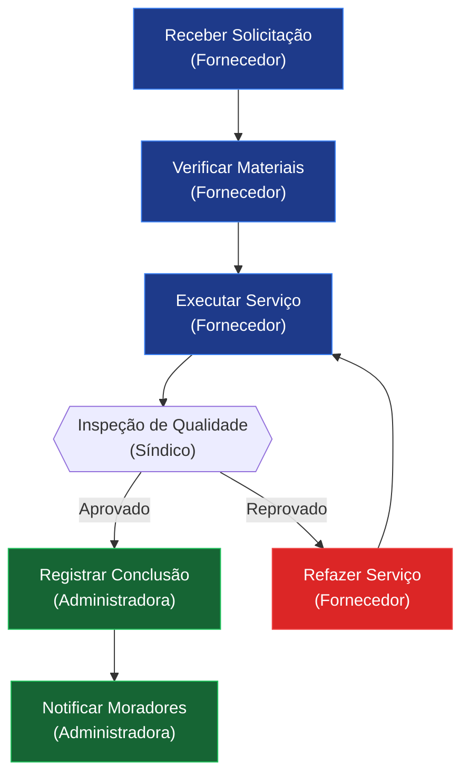

# Plano de Implementação: Ingestão e Processamento de Contratos de Fornecedores

**Feature**: 007-ingestao-contratos-fornecedores  
**Data**: 2024-12-09  
**Prioridade**: Alta  

---

## 1. Visão Geral

### Objetivo
Automatizar a criação de processos condominiais a partir de contratos de fornecedores usando IA para ler, interpretar e gerar processos estruturados seguindo o template existente.

### Fluxo Principal
```
[Upload Contrato] 
    ↓
[Extração de Texto] 
    ↓
[Análise por IA] 
    ↓
[Geração de Processos] 
    ↓
[Revisão Humana] 
    ↓
[Workflow de Aprovação]
```

### Stack Tecnológica

**Backend**:
- Python 3.11+
- FastAPI
- SQLAlchemy
- PostgreSQL
- Celery (para processamento assíncrono)
- Redis (para filas)

**IA & Processamento**:
- OpenAI GPT-4 ou Anthropic Claude (análise e geração)
- PyPDF2 ou pdfplumber (extração PDF)
- python-docx (extração DOCX)
- Tesseract OCR ou Google Vision API (OCR para imagens)
- Langchain (orquestração de LLM)

**Frontend**:
- Next.js 14+
- React
- TypeScript
- TailwindCSS
- Componentes UI existentes

**Armazenamento**:
- S3 ou armazenamento local (documentos)
- PostgreSQL (metadados e processos)

---

## 2. Arquitetura

### 2.1 Componentes Backend

```
backend/src/app/
├── api/v1/endpoints/
│   └── contracts.py          # Endpoints de contratos
├── services/
│   ├── contract_service.py        # Lógica de negócio de contratos
│   ├── extraction_service.py      # Extração de texto de documentos
│   ├── ai_analysis_service.py     # Análise por IA
│   ├── process_generation_service.py  # Geração de processos
│   └── entity_matching_service.py # Matching de entidades
├── models/
│   ├── contract.py           # Modelo de Contrato
│   ├── contract_analysis.py  # Modelo de Análise
│   └── process_generation.py # Modelo de Processo Gerado
├── schemas/
│   ├── contract.py           # Schemas Pydantic
│   └── contract_analysis.py
├── tasks/
│   └── contract_tasks.py     # Tasks assíncronas Celery
└── utils/
    ├── pdf_extractor.py      # Utilidades extração PDF
    ├── ocr_processor.py      # Utilidades OCR
    └── llm_client.py         # Cliente LLM
```

### 2.2 Componentes Frontend

```
frontend/src/
├── app/
│   └── (dashboard)/
│       └── contracts/
│           ├── page.tsx                    # Lista de contratos
│           ├── [id]/
│           │   └── page.tsx               # Detalhes do contrato
│           └── [id]/processes/
│               └── [processId]/
│                   └── page.tsx           # Revisão de processo gerado
├── components/
│   └── contracts/
│       ├── ContractUpload.tsx        # Upload de contrato
│       ├── ContractList.tsx          # Lista de contratos
│       ├── ContractDetails.tsx       # Detalhes do contrato
│       ├── AnalysisResults.tsx       # Resultados da análise IA
│       ├── ProcessPreview.tsx        # Preview de processo gerado
│       └── ProcessEditor.tsx         # Editor de processo
└── lib/
    └── api/
        └── contracts.ts              # Client API para contratos
```

---

## 3. Modelos de Dados

### 3.1 Contract (Contrato)

```python
class ContractStatus(str, enum.Enum):
    UPLOADED = "uploaded"           # Upload concluído
    EXTRACTING = "extracting"       # Extraindo texto
    ANALYZING = "analyzing"         # Analisando com IA
    GENERATING = "generating"       # Gerando processos
    REVIEW = "review"              # Aguardando revisão
    COMPLETED = "completed"        # Processamento completo
    ERROR = "error"                # Erro no processamento

class Contract(Base):
    __tablename__ = "contracts"
    
    id = Column(UUID, primary_key=True, default=uuid.uuid4)
    
    # Informações básicas
    supplier_name = Column(String(255), nullable=False)
    service_type = Column(String(255), nullable=False)
    contract_number = Column(String(100), nullable=True)
    
    # Documento
    original_file_name = Column(String(255), nullable=False)
    original_file_path = Column(String(500), nullable=False)
    file_size = Column(Integer, nullable=False)
    mime_type = Column(String(100), nullable=False)
    
    # Texto extraído
    extracted_text = Column(Text, nullable=True)
    extraction_method = Column(String(50), nullable=True)  # "native", "ocr"
    extraction_confidence = Column(Float, nullable=True)
    
    # Datas e valores
    contract_start_date = Column(Date, nullable=True)
    contract_end_date = Column(Date, nullable=True)
    monthly_value = Column(Float, nullable=True)
    
    # Status
    status = Column(SQLEnum(ContractStatus), nullable=False, default=ContractStatus.UPLOADED)
    error_message = Column(Text, nullable=True)
    
    # Metadados
    uploaded_by_id = Column(UUID, ForeignKey("stakeholders.id"), nullable=False)
    uploaded_at = Column(DateTime, default=datetime.utcnow, nullable=False)
    processed_at = Column(DateTime, nullable=True)
    
    # Relacionamentos
    uploaded_by = relationship("Stakeholder")
    analysis = relationship("ContractAnalysis", back_populates="contract", uselist=False)
    generated_processes = relationship("Process", back_populates="source_contract")
    processing_history = relationship("ContractHistory", back_populates="contract")
```

### 3.2 ContractAnalysis (Análise)

```python
class ContractAnalysis(Base):
    __tablename__ = "contract_analyses"
    
    id = Column(UUID, primary_key=True, default=uuid.uuid4)
    contract_id = Column(UUID, ForeignKey("contracts.id"), nullable=False, unique=True)
    
    # Resultados da análise
    services_identified = Column(JSONB, nullable=False)  # Lista de serviços
    scope_of_work = Column(JSONB, nullable=False)        # Escopo detalhado
    responsibilities = Column(JSONB, nullable=False)     # Responsabilidades
    frequencies = Column(JSONB, nullable=True)           # Frequências
    slas = Column(JSONB, nullable=True)                  # SLAs
    inferred_processes = Column(JSONB, nullable=False)   # Processos inferidos
    
    # Entidades e variáveis identificadas
    identified_entities = Column(JSONB, nullable=True)   # Entidades encontradas
    identified_variables = Column(JSONB, nullable=True)  # Variáveis encontradas
    
    # Metadados da análise
    confidence_score = Column(Float, nullable=False)     # 0.0 - 1.0
    llm_model_used = Column(String(100), nullable=False) # ex: "gpt-4", "claude-sonnet"
    tokens_used = Column(Integer, nullable=True)
    processing_time_seconds = Column(Float, nullable=False)
    analyzed_at = Column(DateTime, default=datetime.utcnow, nullable=False)
    
    # Relacionamentos
    contract = relationship("Contract", back_populates="analysis")
```

### 3.3 Extensão do Process Model

```python
# Adicionar ao modelo Process existente:
class Process(Base):
    # ... campos existentes ...
    
    # Novos campos para processos gerados
    source_contract_id = Column(UUID, ForeignKey("contracts.id"), nullable=True)
    auto_generated = Column(Boolean, default=False, nullable=False)
    generation_confidence = Column(Float, nullable=True)
    reviewed_by_id = Column(UUID, ForeignKey("stakeholders.id"), nullable=True)
    reviewed_at = Column(DateTime, nullable=True)
    edited_after_generation = Column(Boolean, default=False, nullable=False)
    
    # Relacionamentos
    source_contract = relationship("Contract", back_populates="generated_processes")
    reviewed_by = relationship("Stakeholder")
```

### 3.4 ContractHistory (Histórico)

```python
class ContractHistoryEvent(str, enum.Enum):
    UPLOADED = "uploaded"
    EXTRACTION_STARTED = "extraction_started"
    EXTRACTION_COMPLETED = "extraction_completed"
    EXTRACTION_FAILED = "extraction_failed"
    ANALYSIS_STARTED = "analysis_started"
    ANALYSIS_COMPLETED = "analysis_completed"
    ANALYSIS_FAILED = "analysis_failed"
    PROCESS_GENERATION_STARTED = "process_generation_started"
    PROCESS_GENERATED = "process_generated"
    PROCESS_GENERATION_FAILED = "process_generation_failed"
    PROCESS_EDITED = "process_edited"
    PROCESS_APPROVED = "process_approved"
    REPROCESSED = "reprocessed"

class ContractHistory(Base):
    __tablename__ = "contract_history"
    
    id = Column(UUID, primary_key=True, default=uuid.uuid4)
    contract_id = Column(UUID, ForeignKey("contracts.id"), nullable=False)
    
    event_type = Column(SQLEnum(ContractHistoryEvent), nullable=False)
    event_details = Column(JSONB, nullable=True)
    user_id = Column(UUID, ForeignKey("stakeholders.id"), nullable=True)
    created_at = Column(DateTime, default=datetime.utcnow, nullable=False)
    
    # Relacionamentos
    contract = relationship("Contract", back_populates="processing_history")
    user = relationship("Stakeholder")
```

---

## 4. Fluxos de Implementação

### 4.1 Fluxo de Upload e Extração

```
1. Frontend envia arquivo via POST /api/v1/contracts/upload
2. Backend valida arquivo (tipo, tamanho)
3. Salva arquivo no storage (S3 ou local)
4. Cria registro Contract no DB com status "uploaded"
5. Dispara task assíncrona: extract_contract_text
6. Task identifica tipo de arquivo:
   - PDF nativo → usa pdfplumber
   - PDF escaneado → usa OCR (Tesseract/Vision API)
   - DOCX → usa python-docx
   - Imagem → usa OCR
7. Extrai texto e salva em Contract.extracted_text
8. Atualiza status para "extracting" → "analyzing"
9. Dispara próxima task: analyze_contract
```

### 4.2 Fluxo de Análise por IA

```
1. Task analyze_contract recebe contract_id
2. Carrega texto extraído
3. Constrói prompt estruturado para LLM:
   - Contexto: "Você é um especialista em gestão condominial..."
   - Tarefa: "Analise o contrato e identifique..."
   - Formato esperado: JSON estruturado
4. Envia para LLM API (GPT-4 ou Claude)
5. Recebe resposta JSON com:
   - services_identified
   - scope_of_work
   - responsibilities
   - frequencies
   - slas
   - inferred_processes (lista de processos sugeridos)
6. Valida resposta e calcula confidence score
7. Salva ContractAnalysis no DB
8. Atualiza status para "generating"
9. Dispara próxima task: generate_processes
```

### 4.3 Fluxo de Geração de Processos

```
1. Task generate_processes recebe contract_id
2. Carrega ContractAnalysis
3. Para cada processo inferido:
   a. Gera WORKFLOW:
      - Prompt: "Baseado no serviço X, gere etapas numeradas..."
      - LLM retorna lista de etapas
   
   b. Gera RACI:
      - Prompt: "Para cada etapa, defina R, A, C, I..."
      - LLM retorna matriz RACI
      - Valida: cada etapa tem 1 Accountable
   
   c. Identifica ENTIDADES:
      - Extrai entidades do RACI
      - Valida se existem no sistema (entity_matching_service)
      - Se não existe, cria sugestão
   
   d. Identifica VARIÁVEIS:
      - Extrai variáveis mencionadas (horários, frequências)
      - Mapeia para variáveis existentes
      - Se não existe, cria sugestão
   
   e. Gera DIAGRAMA MERMAID:
      - Prompt: "Gere diagrama Mermaid para o workflow..."
      - LLM retorna código Mermaid
      - Valida sintaxe
   
   f. Define METADADOS:
      - Categoria (baseado no tipo de serviço)
      - Ícone (baseado na categoria)
      - Tipo de documento (POP, Manual, etc.)
      - Descrição resumida
   
   g. Cria Process no DB:
      - Status: "rascunho"
      - auto_generated: True
      - source_contract_id: contract.id
      - generation_confidence: score

4. Atualiza Contract status para "review"
5. Notifica administrador
```

### 4.4 Fluxo de Revisão e Edição

```
1. Administrador acessa /contracts/{id}
2. Visualiza análise da IA
3. Visualiza lista de processos gerados
4. Para cada processo:
   a. Clica para revisar
   b. Vê preview completo (workflow, RACI, diagrama)
   c. Pode editar qualquer campo
   d. Salva edições (marca edited_after_generation = True)
5. Valida processo:
   - Workflow completo
   - RACI completo e consistente
   - Entidades válidas
   - Diagrama renderiza
6. Envia para aprovação (muda status para "em_revisao")
7. Processo entra no workflow de aprovação existente
```

---

## 5. Prompts para LLM

### 5.1 Prompt de Análise de Contrato

```python
ANALYSIS_PROMPT = """
Você é um especialista em gestão condominial e análise de contratos de fornecedores.

Analise o contrato abaixo e extraia as seguintes informações em formato JSON:

CONTRATO:
{contract_text}

TAREFA:
Extraia e estruture as seguintes informações:

1. **services_identified**: Lista de serviços que o fornecedor prestará (ex: "Limpeza de áreas comuns", "Jardinagem", "Segurança")

2. **scope_of_work**: Escopo detalhado de cada serviço, incluindo:
   - O que está incluído
   - Áreas/locais cobertos
   - Materiais fornecidos pelo fornecedor ou condomínio
   - Exclusões

3. **responsibilities**: Responsabilidades de cada parte (fornecedor, condomínio, síndico)

4. **frequencies**: Frequência de execução de cada serviço (ex: diária, 3x por semana, mensal)

5. **slas**: SLAs e métricas de desempenho mencionadas

6. **inferred_processes**: Para cada serviço identificado, infira quais PROCESSOS CONDOMINIAIS serão necessários. Considere processos nas categorias:
   - Governança (aprovações, documentação)
   - Operação (execução do serviço, checklists)
   - Áreas Comuns (se relevante)
   - Segurança (se relevante)
   
   Para cada processo inferido, forneça:
   - name: Nome descritivo do processo
   - category: Uma de ["Governança", "Acesso e Segurança", "Operação", "Áreas Comuns", "Convivência", "Eventos", "Emergências"]
   - description: Descrição resumida (2-3 frases)
   - documentType: Uma de ["Manual", "POP", "Regulamento", "Formulário", "Procedimento de Emergência"]

IMPORTANTE: 
- Seja específico e baseie-se apenas no que está no contrato
- Se alguma informação não estiver clara, indique com null
- Priorize processos operacionais que precisarão ser executados
- Considere processos de supervisão e controle de qualidade

FORMATO DE RESPOSTA (JSON):
{{
  "services_identified": ["serviço 1", "serviço 2"],
  "scope_of_work": {{
    "serviço 1": {{
      "included": ["..."],
      "areas": ["..."],
      "materials": "...",
      "exclusions": ["..."]
    }}
  }},
  "responsibilities": {{
    "fornecedor": ["..."],
    "condominio": ["..."],
    "sindico": ["..."]
  }},
  "frequencies": {{
    "serviço 1": "diária",
    "serviço 2": "3x por semana"
  }},
  "slas": {{
    "tempo_resposta": "...",
    "indicadores": ["..."]
  }},
  "inferred_processes": [
    {{
      "name": "Nome do Processo",
      "category": "Operação",
      "description": "Descrição do processo...",
      "documentType": "POP"
    }}
  ]
}}
"""
```

### 5.2 Prompt de Geração de Workflow

```python
WORKFLOW_GENERATION_PROMPT = """
Você é um especialista em processos condominiais e gestão operacional.

Baseado no PROCESSO abaixo, gere um WORKFLOW detalhado com etapas numeradas.

PROCESSO:
Nome: {process_name}
Categoria: {process_category}
Descrição: {process_description}
Serviço do Contrato: {service_info}

CONTEXTO ADICIONAL:
{scope_of_work}
{responsibilities}
{frequencies}

TAREFA:
Gere um workflow (lista de etapas) que descreva COMO executar este processo do início ao fim.

DIRETRIZES:
- Cada etapa deve ser acionável e clara
- Inclua etapas de preparação, execução, validação e registro
- Considere aprovações quando necessário
- Inclua controle de qualidade
- Numere as etapas sequencialmente
- Cada etapa: "N. Descrição clara da ação"

EXEMPLO:
[
  "1. Receber solicitação ou checklist de execução",
  "2. Verificar disponibilidade de materiais necessários",
  "3. Executar o serviço na área designada",
  "4. Realizar inspeção de qualidade",
  "5. Registrar conclusão no sistema",
  "6. Notificar síndico sobre conclusão"
]

FORMATO DE RESPOSTA (JSON):
{{
  "workflow": [
    "1. ...",
    "2. ...",
    "..."
  ]
}}
"""
```

### 5.3 Prompt de Geração de RACI

```python
RACI_GENERATION_PROMPT = """
Você é um especialista em gestão de responsabilidades e matriz RACI.

Para o PROCESSO e WORKFLOW abaixo, defina a matriz RACI completa.

PROCESSO:
Nome: {process_name}
Categoria: {process_category}

WORKFLOW:
{workflow_steps}

ENTIDADES DISPONÍVEIS NO SISTEMA:
{available_entities}

CONTEXTO DO CONTRATO:
Fornecedor: {supplier_name}
Responsabilidades: {responsibilities}

TAREFA:
Para CADA etapa do workflow, defina:
- **Responsible (R)**: Quem EXECUTA a tarefa (pode ser múltiplos)
- **Accountable (A)**: Quem APROVA/decide (SEMPRE exatamente 1 pessoa/entidade)
- **Consulted (C)**: Quem é CONSULTADO antes da execução (opcional)
- **Informed (I)**: Quem é INFORMADO após a execução (opcional)

REGRAS IMPORTANTES:
1. Cada etapa DEVE ter exatamente 1 Accountable
2. Geralmente Accountable é: Síndico, Administradora ou Conselho
3. Fornecedor deve ser Responsible nas etapas de execução
4. Use entidades da lista disponível sempre que possível
5. Se precisar de entidade não listada, pode sugerir, mas indique como "new_entity"

FORMATO DE RESPOSTA (JSON):
{{
  "raci": [
    {{
      "step": "1. Primeira etapa do workflow",
      "responsible": ["Fornecedor"],
      "accountable": ["Síndico"],
      "consulted": [],
      "informed": ["Moradores"]
    }},
    {{
      "step": "2. Segunda etapa...",
      "responsible": ["..."],
      "accountable": ["..."],
      "consulted": [],
      "informed": []
    }}
  ],
  "new_entities_suggested": [
    {{
      "name": "Nome da Nova Entidade",
      "type": "fornecedor|morador|empresa|outro",
      "reason": "Por que esta entidade é necessária"
    }}
  ]
}}
"""
```

### 5.4 Prompt de Geração de Diagrama Mermaid

```python
MERMAID_GENERATION_PROMPT = """
Você é um especialista em diagramas de fluxo e notação Mermaid.

Baseado no WORKFLOW e RACI abaixo, gere um diagrama Mermaid que represente o fluxo visualmente.

WORKFLOW:
{workflow_steps}

RACI:
{raci_matrix}

TAREFA:
Gere um diagrama Mermaid (flowchart TD) que:
1. Represente cada etapa do workflow como um nó
2. Indique o RESPONSÁVEL em cada nó usando formato: ["Atividade<br/>(Responsável)"]
3. Conecte etapas sequencialmente com setas (-->)
4. Use nós de decisão ({{}}) quando houver condicionais ou aprovações
5. Aplique cores:
   - Azul (#1e3a8a): Execução normal
   - Verde (#166534): Aprovações e validações
   - Vermelho (#dc2626): Rejeições ou urgências

EXEMPLO:


FORMATO DE RESPOSTA (JSON):
{{
  "mermaid_diagram": "flowchart TD\\n    A[...]\\n    ..."
}}
"""
```

---

## 6. APIs e Endpoints

### 6.1 Endpoints de Contratos

```python
# POST /api/v1/contracts/upload
# Multipart form-data: file, supplier_name, service_type
async def upload_contract(
    file: UploadFile,
    supplier_name: str = Form(...),
    service_type: str = Form(...),
    contract_number: Optional[str] = Form(None),
    start_date: Optional[date] = Form(None),
    end_date: Optional[date] = Form(None),
    monthly_value: Optional[float] = Form(None),
    current_user: Stakeholder = Depends(get_current_user)
) -> ContractResponse

# GET /api/v1/contracts
# Lista todos os contratos
async def list_contracts(
    skip: int = 0,
    limit: int = 100,
    status: Optional[ContractStatus] = None,
    supplier_name: Optional[str] = None,
    current_user: Stakeholder = Depends(get_current_user)
) -> List[ContractResponse]

# GET /api/v1/contracts/{contract_id}
# Detalhes de um contrato
async def get_contract(
    contract_id: UUID,
    current_user: Stakeholder = Depends(get_current_user)
) -> ContractDetailResponse

# GET /api/v1/contracts/{contract_id}/analysis
# Análise do contrato
async def get_contract_analysis(
    contract_id: UUID,
    current_user: Stakeholder = Depends(get_current_user)
) -> ContractAnalysisResponse

# GET /api/v1/contracts/{contract_id}/processes
# Processos gerados pelo contrato
async def get_contract_processes(
    contract_id: UUID,
    current_user: Stakeholder = Depends(get_current_user)
) -> List[ProcessResponse]

# POST /api/v1/contracts/{contract_id}/reprocess
# Reprocessar contrato
async def reprocess_contract(
    contract_id: UUID,
    current_user: Stakeholder = Depends(get_current_user)
) -> ContractResponse

# GET /api/v1/contracts/{contract_id}/download
# Download do documento original
async def download_contract(
    contract_id: UUID,
    current_user: Stakeholder = Depends(get_current_user)
) -> FileResponse

# GET /api/v1/contracts/{contract_id}/history
# Histórico de processamento
async def get_contract_history(
    contract_id: UUID,
    current_user: Stakeholder = Depends(get_current_user)
) -> List[ContractHistoryResponse]

# DELETE /api/v1/contracts/{contract_id}
# Deletar contrato (e processos não aprovados)
async def delete_contract(
    contract_id: UUID,
    current_user: Stakeholder = Depends(get_current_user)
) -> MessageResponse
```

### 6.2 Endpoints de Processos Gerados

```python
# GET /api/v1/processes/{process_id}
# Já existe, mas adicionar informações de processo gerado

# PUT /api/v1/processes/{process_id}
# Editar processo gerado
async def update_process(
    process_id: UUID,
    process_update: ProcessUpdate,
    current_user: Stakeholder = Depends(get_current_user)
) -> ProcessResponse

# POST /api/v1/processes/{process_id}/submit-for-approval
# Enviar processo para workflow de aprovação
async def submit_process_for_approval(
    process_id: UUID,
    current_user: Stakeholder = Depends(get_current_user)
) -> ProcessResponse
```

### 6.3 Schemas Pydantic

```python
# Requests
class ContractUploadRequest(BaseModel):
    supplier_name: str
    service_type: str
    contract_number: Optional[str] = None
    start_date: Optional[date] = None
    end_date: Optional[date] = None
    monthly_value: Optional[float] = None

# Responses
class ContractResponse(BaseModel):
    id: UUID
    supplier_name: str
    service_type: str
    original_file_name: str
    status: ContractStatus
    uploaded_at: datetime
    processed_at: Optional[datetime]
    error_message: Optional[str]
    processes_count: int

class ContractAnalysisResponse(BaseModel):
    id: UUID
    contract_id: UUID
    services_identified: List[str]
    scope_of_work: Dict
    responsibilities: Dict
    inferred_processes: List[Dict]
    confidence_score: float
    analyzed_at: datetime

class ProcessResponse(BaseModel):
    id: UUID
    name: str
    category: str
    status: ProcessStatus
    auto_generated: bool
    generation_confidence: Optional[float]
    source_contract_id: Optional[UUID]
    edited_after_generation: bool
    workflow: List[str]
    entities: List[str]
    # ... outros campos do Process
```

---

## 7. Tasks Assíncronas (Celery)

### 7.1 Task de Extração de Texto

```python
# backend/src/app/tasks/contract_tasks.py

@celery_app.task(bind=True, max_retries=3)
def extract_contract_text_task(self, contract_id: str):
    """
    Extrai texto de contrato PDF, DOCX ou imagem.
    """
    try:
        contract = db.query(Contract).filter(Contract.id == contract_id).first()
        if not contract:
            raise ValueError(f"Contract {contract_id} not found")
        
        # Atualiza status
        contract.status = ContractStatus.EXTRACTING
        db.commit()
        
        # Chama service de extração
        extraction_service = ExtractionService()
        result = extraction_service.extract_text(contract.original_file_path, contract.mime_type)
        
        # Salva resultado
        contract.extracted_text = result["text"]
        contract.extraction_method = result["method"]
        contract.extraction_confidence = result["confidence"]
        contract.status = ContractStatus.ANALYZING
        db.commit()
        
        # Log histórico
        add_history(contract_id, ContractHistoryEvent.EXTRACTION_COMPLETED, result)
        
        # Dispara próxima task
        analyze_contract_task.delay(str(contract_id))
        
    except Exception as exc:
        contract.status = ContractStatus.ERROR
        contract.error_message = str(exc)
        db.commit()
        add_history(contract_id, ContractHistoryEvent.EXTRACTION_FAILED, {"error": str(exc)})
        raise self.retry(exc=exc, countdown=60)
```

### 7.2 Task de Análise por IA

```python
@celery_app.task(bind=True, max_retries=2)
def analyze_contract_task(self, contract_id: str):
    """
    Analisa contrato usando LLM e gera insights estruturados.
    """
    try:
        contract = db.query(Contract).filter(Contract.id == contract_id).first()
        
        add_history(contract_id, ContractHistoryEvent.ANALYSIS_STARTED)
        
        # Chama service de análise IA
        ai_service = AIAnalysisService()
        analysis_result = ai_service.analyze_contract(contract.extracted_text)
        
        # Salva análise
        analysis = ContractAnalysis(
            contract_id=contract.id,
            services_identified=analysis_result["services_identified"],
            scope_of_work=analysis_result["scope_of_work"],
            responsibilities=analysis_result["responsibilities"],
            frequencies=analysis_result["frequencies"],
            slas=analysis_result["slas"],
            inferred_processes=analysis_result["inferred_processes"],
            confidence_score=analysis_result["confidence_score"],
            llm_model_used=analysis_result["model_used"],
            tokens_used=analysis_result["tokens_used"],
            processing_time_seconds=analysis_result["processing_time"]
        )
        db.add(analysis)
        
        contract.status = ContractStatus.GENERATING
        db.commit()
        
        add_history(contract_id, ContractHistoryEvent.ANALYSIS_COMPLETED, analysis_result)
        
        # Dispara geração de processos
        generate_processes_task.delay(str(contract_id))
        
    except Exception as exc:
        contract.status = ContractStatus.ERROR
        contract.error_message = str(exc)
        db.commit()
        add_history(contract_id, ContractHistoryEvent.ANALYSIS_FAILED, {"error": str(exc)})
        raise self.retry(exc=exc, countdown=120)
```

### 7.3 Task de Geração de Processos

```python
@celery_app.task(bind=True, max_retries=2)
def generate_processes_task(self, contract_id: str):
    """
    Gera processos estruturados baseado na análise do contrato.
    """
    try:
        contract = db.query(Contract).filter(Contract.id == contract_id).first()
        analysis = contract.analysis
        
        add_history(contract_id, ContractHistoryEvent.PROCESS_GENERATION_STARTED)
        
        generation_service = ProcessGenerationService()
        
        for inferred_process in analysis.inferred_processes:
            try:
                # Gera workflow
                workflow = generation_service.generate_workflow(
                    inferred_process, 
                    analysis.scope_of_work, 
                    analysis.responsibilities
                )
                
                # Gera RACI
                raci = generation_service.generate_raci(
                    inferred_process, 
                    workflow, 
                    analysis.responsibilities,
                    contract.supplier_name
                )
                
                # Gera Mermaid
                mermaid = generation_service.generate_mermaid_diagram(workflow, raci)
                
                # Identifica entidades
                entities = generation_service.identify_entities(raci)
                validated_entities = entity_matching_service.validate_entities(entities)
                
                # Identifica variáveis
                variables = generation_service.identify_variables(
                    analysis.scope_of_work, 
                    analysis.frequencies
                )
                
                # Cria processo
                process = Process(
                    name=inferred_process["name"],
                    category=inferred_process["category"],
                    icon=generation_service.get_icon_for_category(inferred_process["category"]),
                    status=ProcessStatus.RASCUNHO,
                    description=inferred_process["description"],
                    workflow=workflow,
                    entities=validated_entities["existing"],
                    variables=variables,
                    documentType=inferred_process["documentType"],
                    mermaid_diagram=mermaid,
                    raci=raci,
                    source_contract_id=contract.id,
                    auto_generated=True,
                    generation_confidence=analysis.confidence_score,
                    creator_id=contract.uploaded_by_id
                )
                db.add(process)
                db.commit()
                
                add_history(contract_id, ContractHistoryEvent.PROCESS_GENERATED, {
                    "process_id": str(process.id),
                    "process_name": process.name
                })
                
                # Cria sugestões de entidades novas se necessário
                for new_entity in validated_entities["suggestions"]:
                    # Salvar sugestão de entidade para aprovação
                    pass
                
            except Exception as proc_exc:
                add_history(contract_id, ContractHistoryEvent.PROCESS_GENERATION_FAILED, {
                    "process_name": inferred_process["name"],
                    "error": str(proc_exc)
                })
                continue
        
        # Finaliza processamento
        contract.status = ContractStatus.REVIEW
        contract.processed_at = datetime.utcnow()
        db.commit()
        
        # Notifica administrador
        # TODO: notification_service.notify_contract_processed(contract_id)
        
    except Exception as exc:
        contract.status = ContractStatus.ERROR
        contract.error_message = str(exc)
        db.commit()
        raise self.retry(exc=exc, countdown=120)
```

---

## 8. Serviços (Services)

### 8.1 ExtractionService

```python
# backend/src/app/services/extraction_service.py

class ExtractionService:
    def extract_text(self, file_path: str, mime_type: str) -> Dict:
        """
        Extrai texto de arquivo baseado no tipo.
        
        Returns:
            {
                "text": str,
                "method": str ("native" | "ocr"),
                "confidence": float (0.0 - 1.0)
            }
        """
        if mime_type == "application/pdf":
            return self._extract_from_pdf(file_path)
        elif mime_type in ["application/vnd.openxmlformats-officedocument.wordprocessingml.document", "application/msword"]:
            return self._extract_from_docx(file_path)
        elif mime_type in ["image/png", "image/jpeg", "image/jpg"]:
            return self._extract_from_image_ocr(file_path)
        else:
            raise ValueError(f"Unsupported file type: {mime_type}")
    
    def _extract_from_pdf(self, file_path: str) -> Dict:
        """Extrai de PDF, tenta nativo primeiro, depois OCR."""
        try:
            # Tenta extração nativa
            import pdfplumber
            with pdfplumber.open(file_path) as pdf:
                text = ""
                for page in pdf.pages:
                    text += page.extract_text() or ""
            
            # Se extraiu texto suficiente, considera nativo
            if len(text.strip()) > 100:
                return {
                    "text": text,
                    "method": "native",
                    "confidence": 0.95
                }
            else:
                # Fallback para OCR
                return self._extract_from_pdf_ocr(file_path)
        except Exception:
            return self._extract_from_pdf_ocr(file_path)
    
    def _extract_from_pdf_ocr(self, file_path: str) -> Dict:
        """Extrai de PDF usando OCR."""
        # Implementar com Tesseract ou Google Vision API
        pass
    
    def _extract_from_docx(self, file_path: str) -> Dict:
        """Extrai de DOCX."""
        import docx
        doc = docx.Document(file_path)
        text = "\n".join([para.text for para in doc.paragraphs])
        return {
            "text": text,
            "method": "native",
            "confidence": 0.98
        }
    
    def _extract_from_image_ocr(self, file_path: str) -> Dict:
        """Extrai de imagem usando OCR."""
        # Implementar com Tesseract ou Google Vision API
        pass
```

### 8.2 AIAnalysisService

```python
# backend/src/app/services/ai_analysis_service.py

class AIAnalysisService:
    def __init__(self):
        self.llm_client = LLMClient()  # Wrapper para OpenAI ou Anthropic
    
    def analyze_contract(self, contract_text: str) -> Dict:
        """
        Analisa contrato usando LLM e retorna insights estruturados.
        """
        start_time = time.time()
        
        # Constrói prompt
        prompt = ANALYSIS_PROMPT.format(contract_text=contract_text)
        
        # Chama LLM
        response = self.llm_client.generate(
            prompt=prompt,
            model="gpt-4",
            response_format={"type": "json_object"},
            temperature=0.3,
            max_tokens=4000
        )
        
        # Parse resposta
        result = json.loads(response.content)
        
        # Calcula confidence score baseado em completude
        confidence = self._calculate_confidence(result)
        
        processing_time = time.time() - start_time
        
        return {
            **result,
            "confidence_score": confidence,
            "model_used": response.model,
            "tokens_used": response.usage.total_tokens,
            "processing_time": processing_time
        }
    
    def _calculate_confidence(self, result: Dict) -> float:
        """
        Calcula score de confiança baseado em completude da análise.
        """
        score = 0.0
        
        # Services identified
        if len(result.get("services_identified", [])) > 0:
            score += 0.2
        
        # Scope of work
        if result.get("scope_of_work") and len(result["scope_of_work"]) > 0:
            score += 0.2
        
        # Responsibilities
        if result.get("responsibilities") and len(result["responsibilities"]) > 0:
            score += 0.15
        
        # Frequencies
        if result.get("frequencies"):
            score += 0.1
        
        # Inferred processes
        processes = result.get("inferred_processes", [])
        if len(processes) > 0:
            score += 0.25
            # Verifica qualidade dos processos
            complete_processes = sum(1 for p in processes if all(k in p for k in ["name", "category", "description", "documentType"]))
            if complete_processes == len(processes):
                score += 0.1
        
        return min(score, 1.0)
```

### 8.3 ProcessGenerationService

```python
# backend/src/app/services/process_generation_service.py

class ProcessGenerationService:
    def __init__(self):
        self.llm_client = LLMClient()
    
    def generate_workflow(self, process_info: Dict, scope: Dict, responsibilities: Dict) -> List[str]:
        """Gera workflow para processo."""
        prompt = WORKFLOW_GENERATION_PROMPT.format(
            process_name=process_info["name"],
            process_category=process_info["category"],
            process_description=process_info["description"],
            service_info=json.dumps(process_info, ensure_ascii=False),
            scope_of_work=json.dumps(scope, ensure_ascii=False),
            responsibilities=json.dumps(responsibilities, ensure_ascii=False),
            frequencies="{}"  # TODO
        )
        
        response = self.llm_client.generate(
            prompt=prompt,
            model="gpt-4",
            response_format={"type": "json_object"},
            temperature=0.4
        )
        
        result = json.loads(response.content)
        return result["workflow"]
    
    def generate_raci(self, process_info: Dict, workflow: List[str], responsibilities: Dict, supplier_name: str) -> List[Dict]:
        """Gera matriz RACI."""
        # Busca entidades disponíveis
        available_entities = self._get_available_entities()
        
        prompt = RACI_GENERATION_PROMPT.format(
            process_name=process_info["name"],
            process_category=process_info["category"],
            workflow_steps="\n".join(workflow),
            available_entities=", ".join(available_entities),
            supplier_name=supplier_name,
            responsibilities=json.dumps(responsibilities, ensure_ascii=False)
        )
        
        response = self.llm_client.generate(
            prompt=prompt,
            model="gpt-4",
            response_format={"type": "json_object"},
            temperature=0.3
        )
        
        result = json.loads(response.content)
        
        # Valida RACI
        validated_raci = self._validate_raci(result["raci"], workflow)
        
        return validated_raci
    
    def generate_mermaid_diagram(self, workflow: List[str], raci: List[Dict]) -> str:
        """Gera diagrama Mermaid."""
        prompt = MERMAID_GENERATION_PROMPT.format(
            workflow_steps="\n".join(workflow),
            raci_matrix=json.dumps(raci, ensure_ascii=False)
        )
        
        response = self.llm_client.generate(
            prompt=prompt,
            model="gpt-4",
            response_format={"type": "json_object"},
            temperature=0.5
        )
        
        result = json.loads(response.content)
        mermaid_code = result["mermaid_diagram"]
        
        # Valida sintaxe
        if self._validate_mermaid_syntax(mermaid_code):
            return mermaid_code
        else:
            # Fallback para diagrama simples
            return self._generate_simple_mermaid(workflow, raci)
    
    def identify_entities(self, raci: List[Dict]) -> List[str]:
        """Extrai lista de entidades únicas do RACI."""
        entities = set()
        for step in raci:
            entities.update(step.get("responsible", []))
            entities.update(step.get("accountable", []))
            entities.update(step.get("consulted", []))
            entities.update(step.get("informed", []))
        return list(entities)
    
    def identify_variables(self, scope: Dict, frequencies: Dict) -> List[str]:
        """Identifica variáveis do sistema mencionadas."""
        variables = []
        
        # Procura por padrões de horários
        text = json.dumps(scope) + json.dumps(frequencies)
        
        # Horários
        if "horário" in text.lower() or "hora" in text.lower():
            # Mapear para variáveis existentes
            if "limpeza" in text.lower():
                variables.append("horario_limpeza")
            if "jardinagem" in text.lower():
                variables.append("horario_jardinagem")
        
        # Frequências
        if frequencies:
            for service, freq in frequencies.items():
                variables.append(f"frequencia_{service.lower().replace(' ', '_')}")
        
        return variables
    
    def get_icon_for_category(self, category: str) -> str:
        """Retorna ícone apropriado para categoria."""
        icon_map = {
            "Governança": "FileText",
            "Acesso e Segurança": "Shield",
            "Operação": "Wrench",
            "Áreas Comuns": "Building2",
            "Convivência": "Users",
            "Eventos": "Calendar",
            "Emergências": "AlertTriangle"
        }
        return icon_map.get(category, "FileText")
    
    def _validate_raci(self, raci: List[Dict], workflow: List[str]) -> List[Dict]:
        """Valida e corrige RACI."""
        validated = []
        
        for i, step in enumerate(workflow):
            raci_entry = raci[i] if i < len(raci) else {}
            
            # Garante estrutura
            validated_entry = {
                "step": step,
                "responsible": raci_entry.get("responsible", ["Fornecedor"]),
                "accountable": raci_entry.get("accountable", ["Síndico"]),
                "consulted": raci_entry.get("consulted", []),
                "informed": raci_entry.get("informed", [])
            }
            
            # Garante exatamente 1 Accountable
            if len(validated_entry["accountable"]) == 0:
                validated_entry["accountable"] = ["Síndico"]
            elif len(validated_entry["accountable"]) > 1:
                validated_entry["accountable"] = [validated_entry["accountable"][0]]
            
            validated.append(validated_entry)
        
        return validated
    
    def _get_available_entities(self) -> List[str]:
        """Busca lista de entidades cadastradas no sistema."""
        # Query no banco de dados
        entities = db.query(Entity.name).all()
        return [e.name for e in entities]
    
    def _validate_mermaid_syntax(self, mermaid_code: str) -> bool:
        """Valida sintaxe básica do Mermaid."""
        # Checks básicos
        if not mermaid_code.strip().startswith("flowchart"):
            return False
        if "-->" not in mermaid_code:
            return False
        return True
    
    def _generate_simple_mermaid(self, workflow: List[str], raci: List[Dict]) -> str:
        """Gera diagrama Mermaid simples e direto."""
        nodes = []
        edges = []
        
        for i, step in enumerate(workflow):
            node_id = chr(65 + i)  # A, B, C...
            responsible = raci[i]["responsible"][0] if i < len(raci) and raci[i]["responsible"] else "Responsável"
            step_name = step.split(". ", 1)[1] if ". " in step else step
            
            nodes.append(f'{node_id}["{step_name}<br/>({responsible})"]')
            
            if i > 0:
                edges.append(f"{chr(65 + i - 1)} --> {node_id}")
            
            # Estilo
            nodes.append(f"style {node_id} fill:#1e3a8a,stroke:#3b82f6,color:#fff")
        
        diagram = "flowchart TD\n    " + "\n    ".join(nodes + edges)
        return diagram
```

### 8.4 EntityMatchingService

```python
# backend/src/app/services/entity_matching_service.py

class EntityMatchingService:
    def validate_entities(self, entity_names: List[str]) -> Dict:
        """
        Valida se entidades existem no sistema.
        
        Returns:
            {
                "existing": [entidades que existem],
                "suggestions": [sugestões de entidades novas]
            }
        """
        existing = []
        suggestions = []
        
        for entity_name in entity_names:
            # Busca exata
            entity = db.query(Entity).filter(Entity.name == entity_name).first()
            
            if entity:
                existing.append(entity_name)
            else:
                # Busca fuzzy (opcional)
                similar = self._find_similar_entity(entity_name)
                
                if similar:
                    # Usa similar
                    existing.append(similar.name)
                else:
                    # Sugere criação
                    suggestions.append({
                        "name": entity_name,
                        "type": self._infer_entity_type(entity_name),
                        "reason": f"Entidade '{entity_name}' mencionada no processo mas não cadastrada"
                    })
        
        return {
            "existing": existing,
            "suggestions": suggestions
        }
    
    def _find_similar_entity(self, entity_name: str) -> Optional[Entity]:
        """Busca entidade similar (fuzzy matching)."""
        # Implementar busca fuzzy (ex: difflib, fuzzywuzzy)
        from difflib import get_close_matches
        
        all_entities = db.query(Entity.name).all()
        entity_names = [e.name for e in all_entities]
        
        matches = get_close_matches(entity_name, entity_names, n=1, cutoff=0.8)
        
        if matches:
            return db.query(Entity).filter(Entity.name == matches[0]).first()
        
        return None
    
    def _infer_entity_type(self, entity_name: str) -> str:
        """Infere tipo de entidade pelo nome."""
        name_lower = entity_name.lower()
        
        if any(word in name_lower for word in ["fornecedor", "empresa", "prestador"]):
            return "fornecedor"
        elif any(word in name_lower for word in ["morador", "proprietário"]):
            return "morador"
        elif any(word in name_lower for word in ["síndico", "conselho", "administradora"]):
            return "governanca"
        else:
            return "outro"
```

---

## 9. Frontend

### 9.1 Página de Upload

```typescript
// frontend/src/app/(dashboard)/contracts/page.tsx

'use client';

import { useState } from 'react';
import { ContractUpload } from '@/components/contracts/ContractUpload';
import { ContractList } from '@/components/contracts/ContractList';

export default function ContractsPage() {
  const [refreshKey, setRefreshKey] = useState(0);

  const handleUploadSuccess = () => {
    setRefreshKey(prev => prev + 1);
  };

  return (
    <div className="space-y-6">
      <div>
        <h1 className="text-3xl font-bold">Contratos de Fornecedores</h1>
        <p className="text-gray-600 mt-2">
          Faça upload de contratos para gerar processos automaticamente
        </p>
      </div>

      <ContractUpload onSuccess={handleUploadSuccess} />

      <ContractList key={refreshKey} />
    </div>
  );
}
```

### 9.2 Componente de Upload

```typescript
// frontend/src/components/contracts/ContractUpload.tsx

'use client';

import { useState } from 'react';
import { Button } from '@/components/ui/button';
import { Input } from '@/components/ui/input';
import { Label } from '@/components/ui/label';
import { uploadContract } from '@/lib/api/contracts';

export function ContractUpload({ onSuccess }: { onSuccess: () => void }) {
  const [file, setFile] = useState<File | null>(null);
  const [supplierName, setSupplierName] = useState('');
  const [serviceType, setServiceType] = useState('');
  const [isUploading, setIsUploading] = useState(false);

  const handleSubmit = async (e: React.FormEvent) => {
    e.preventDefault();
    
    if (!file || !supplierName || !serviceType) {
      alert('Preencha todos os campos obrigatórios');
      return;
    }

    setIsUploading(true);

    try {
      await uploadContract(file, { supplierName, serviceType });
      alert('Contrato enviado com sucesso! Processamento iniciado.');
      
      // Reset form
      setFile(null);
      setSupplierName('');
      setServiceType('');
      onSuccess();
    } catch (error) {
      console.error('Erro ao enviar contrato:', error);
      alert('Erro ao enviar contrato. Tente novamente.');
    } finally {
      setIsUploading(false);
    }
  };

  return (
    <div className="bg-white p-6 rounded-lg shadow">
      <h2 className="text-xl font-semibold mb-4">Upload de Contrato</h2>
      
      <form onSubmit={handleSubmit} className="space-y-4">
        <div>
          <Label htmlFor="file">Arquivo do Contrato *</Label>
          <Input
            id="file"
            type="file"
            accept=".pdf,.docx,.doc,.png,.jpg,.jpeg"
            onChange={(e) => setFile(e.target.files?.[0] || null)}
            required
          />
          <p className="text-sm text-gray-500 mt-1">
            Formatos aceitos: PDF, DOCX, DOC, PNG, JPG (máx. 50MB)
          </p>
        </div>

        <div>
          <Label htmlFor="supplierName">Nome do Fornecedor *</Label>
          <Input
            id="supplierName"
            value={supplierName}
            onChange={(e) => setSupplierName(e.target.value)}
            placeholder="Ex: Empresa de Limpeza XYZ"
            required
          />
        </div>

        <div>
          <Label htmlFor="serviceType">Tipo de Serviço *</Label>
          <Input
            id="serviceType"
            value={serviceType}
            onChange={(e) => setServiceType(e.target.value)}
            placeholder="Ex: Limpeza, Jardinagem, Segurança"
            required
          />
        </div>

        <Button type="submit" disabled={isUploading}>
          {isUploading ? 'Enviando...' : 'Enviar Contrato'}
        </Button>
      </form>
    </div>
  );
}
```

### 9.3 Lista de Contratos

```typescript
// frontend/src/components/contracts/ContractList.tsx

'use client';

import { useEffect, useState } from 'react';
import { getContracts } from '@/lib/api/contracts';
import { Contract } from '@/types';
import Link from 'next/link';

export function ContractList() {
  const [contracts, setContracts] = useState<Contract[]>([]);
  const [loading, setLoading] = useState(true);

  useEffect(() => {
    loadContracts();
  }, []);

  const loadContracts = async () => {
    try {
      const data = await getContracts();
      setContracts(data);
    } catch (error) {
      console.error('Erro ao carregar contratos:', error);
    } finally {
      setLoading(false);
    }
  };

  if (loading) return <div>Carregando...</div>;

  return (
    <div className="bg-white rounded-lg shadow">
      <div className="px-6 py-4 border-b">
        <h2 className="text-xl font-semibold">Contratos Cadastrados</h2>
      </div>
      
      <div className="divide-y">
        {contracts.map((contract) => (
          <Link
            key={contract.id}
            href={`/contracts/${contract.id}`}
            className="block px-6 py-4 hover:bg-gray-50 transition"
          >
            <div className="flex items-center justify-between">
              <div>
                <h3 className="font-medium">{contract.supplier_name}</h3>
                <p className="text-sm text-gray-600">{contract.service_type}</p>
                <p className="text-xs text-gray-500 mt-1">
                  Enviado em {new Date(contract.uploaded_at).toLocaleDateString()}
                </p>
              </div>
              
              <div className="text-right">
                <StatusBadge status={contract.status} />
                {contract.processes_count > 0 && (
                  <p className="text-sm text-gray-600 mt-1">
                    {contract.processes_count} processo(s) gerado(s)
                  </p>
                )}
              </div>
            </div>
          </Link>
        ))}
      </div>
    </div>
  );
}

function StatusBadge({ status }: { status: string }) {
  const statusConfig = {
    uploaded: { label: 'Enviado', color: 'bg-blue-100 text-blue-800' },
    extracting: { label: 'Extraindo', color: 'bg-yellow-100 text-yellow-800' },
    analyzing: { label: 'Analisando', color: 'bg-purple-100 text-purple-800' },
    generating: { label: 'Gerando Processos', color: 'bg-indigo-100 text-indigo-800' },
    review: { label: 'Revisão Pendente', color: 'bg-orange-100 text-orange-800' },
    completed: { label: 'Concluído', color: 'bg-green-100 text-green-800' },
    error: { label: 'Erro', color: 'bg-red-100 text-red-800' },
  };

  const config = statusConfig[status as keyof typeof statusConfig] || statusConfig.uploaded;

  return (
    <span className={`px-3 py-1 rounded-full text-xs font-medium ${config.color}`}>
      {config.label}
    </span>
  );
}
```

---

## 10. Migrações de Banco de Dados

### 10.1 Migration: Tabela Contracts

```python
# backend/alembic/versions/007_add_contracts_table.py

"""Add contracts table

Revision ID: 007
Revises: 006
Create Date: 2024-12-09

"""
from alembic import op
import sqlalchemy as sa
from sqlalchemy.dialects import postgresql

def upgrade():
    # Enum types
    op.execute("""
        CREATE TYPE contractstatus AS ENUM (
            'uploaded', 'extracting', 'analyzing', 
            'generating', 'review', 'completed', 'error'
        )
    """)
    
    op.execute("""
        CREATE TYPE contracthistoryevent AS ENUM (
            'uploaded', 'extraction_started', 'extraction_completed', 
            'extraction_failed', 'analysis_started', 'analysis_completed',
            'analysis_failed', 'process_generation_started', 'process_generated',
            'process_generation_failed', 'process_edited', 'process_approved',
            'reprocessed'
        )
    """)
    
    # Contracts table
    op.create_table(
        'contracts',
        sa.Column('id', postgresql.UUID(as_uuid=True), primary_key=True),
        sa.Column('supplier_name', sa.String(255), nullable=False),
        sa.Column('service_type', sa.String(255), nullable=False),
        sa.Column('contract_number', sa.String(100), nullable=True),
        sa.Column('original_file_name', sa.String(255), nullable=False),
        sa.Column('original_file_path', sa.String(500), nullable=False),
        sa.Column('file_size', sa.Integer, nullable=False),
        sa.Column('mime_type', sa.String(100), nullable=False),
        sa.Column('extracted_text', sa.Text, nullable=True),
        sa.Column('extraction_method', sa.String(50), nullable=True),
        sa.Column('extraction_confidence', sa.Float, nullable=True),
        sa.Column('contract_start_date', sa.Date, nullable=True),
        sa.Column('contract_end_date', sa.Date, nullable=True),
        sa.Column('monthly_value', sa.Float, nullable=True),
        sa.Column('status', sa.Enum('uploaded', 'extracting', 'analyzing', 'generating', 'review', 'completed', 'error', name='contractstatus'), nullable=False),
        sa.Column('error_message', sa.Text, nullable=True),
        sa.Column('uploaded_by_id', postgresql.UUID(as_uuid=True), sa.ForeignKey('stakeholders.id'), nullable=False),
        sa.Column('uploaded_at', sa.DateTime, nullable=False),
        sa.Column('processed_at', sa.DateTime, nullable=True),
    )
    
    # Contract analyses table
    op.create_table(
        'contract_analyses',
        sa.Column('id', postgresql.UUID(as_uuid=True), primary_key=True),
        sa.Column('contract_id', postgresql.UUID(as_uuid=True), sa.ForeignKey('contracts.id'), nullable=False, unique=True),
        sa.Column('services_identified', postgresql.JSONB, nullable=False),
        sa.Column('scope_of_work', postgresql.JSONB, nullable=False),
        sa.Column('responsibilities', postgresql.JSONB, nullable=False),
        sa.Column('frequencies', postgresql.JSONB, nullable=True),
        sa.Column('slas', postgresql.JSONB, nullable=True),
        sa.Column('inferred_processes', postgresql.JSONB, nullable=False),
        sa.Column('identified_entities', postgresql.JSONB, nullable=True),
        sa.Column('identified_variables', postgresql.JSONB, nullable=True),
        sa.Column('confidence_score', sa.Float, nullable=False),
        sa.Column('llm_model_used', sa.String(100), nullable=False),
        sa.Column('tokens_used', sa.Integer, nullable=True),
        sa.Column('processing_time_seconds', sa.Float, nullable=False),
        sa.Column('analyzed_at', sa.DateTime, nullable=False),
    )
    
    # Contract history table
    op.create_table(
        'contract_history',
        sa.Column('id', postgresql.UUID(as_uuid=True), primary_key=True),
        sa.Column('contract_id', postgresql.UUID(as_uuid=True), sa.ForeignKey('contracts.id'), nullable=False),
        sa.Column('event_type', sa.Enum(name='contracthistoryevent'), nullable=False),
        sa.Column('event_details', postgresql.JSONB, nullable=True),
        sa.Column('user_id', postgresql.UUID(as_uuid=True), sa.ForeignKey('stakeholders.id'), nullable=True),
        sa.Column('created_at', sa.DateTime, nullable=False),
    )
    
    # Add columns to processes table
    op.add_column('processes', sa.Column('source_contract_id', postgresql.UUID(as_uuid=True), sa.ForeignKey('contracts.id'), nullable=True))
    op.add_column('processes', sa.Column('auto_generated', sa.Boolean, default=False, nullable=False))
    op.add_column('processes', sa.Column('generation_confidence', sa.Float, nullable=True))
    op.add_column('processes', sa.Column('reviewed_by_id', postgresql.UUID(as_uuid=True), sa.ForeignKey('stakeholders.id'), nullable=True))
    op.add_column('processes', sa.Column('reviewed_at', sa.DateTime, nullable=True))
    op.add_column('processes', sa.Column('edited_after_generation', sa.Boolean, default=False, nullable=False))
    
    # Indexes
    op.create_index('ix_contracts_supplier_name', 'contracts', ['supplier_name'])
    op.create_index('ix_contracts_status', 'contracts', ['status'])
    op.create_index('ix_contract_history_contract_id', 'contract_history', ['contract_id'])

def downgrade():
    op.drop_index('ix_contract_history_contract_id')
    op.drop_index('ix_contracts_status')
    op.drop_index('ix_contracts_supplier_name')
    
    op.drop_column('processes', 'edited_after_generation')
    op.drop_column('processes', 'reviewed_at')
    op.drop_column('processes', 'reviewed_by_id')
    op.drop_column('processes', 'generation_confidence')
    op.drop_column('processes', 'auto_generated')
    op.drop_column('processes', 'source_contract_id')
    
    op.drop_table('contract_history')
    op.drop_table('contract_analyses')
    op.drop_table('contracts')
    
    op.execute("DROP TYPE contracthistoryevent")
    op.execute("DROP TYPE contractstatus")
```

---

## 11. Fases de Implementação

### Fase 1: Fundação (Semana 1-2)
- **Objetivo**: Setup básico e extração de texto
- **Tarefas**:
  - [ ] Criar modelos Contract, ContractAnalysis, ContractHistory
  - [ ] Criar migration 007
  - [ ] Implementar ExtractionService (PDF, DOCX)
  - [ ] Implementar endpoint de upload
  - [ ] Implementar storage de arquivos
  - [ ] Implementar página de upload no frontend
  - [ ] Implementar lista de contratos no frontend
  - [ ] Configurar Celery e Redis
  - [ ] Implementar task de extração assíncrona

### Fase 2: IA e Análise (Semana 3-4)
- **Objetivo**: Análise inteligente de contratos
- **Tarefas**:
  - [ ] Configurar LLM client (OpenAI ou Anthropic)
  - [ ] Implementar AIAnalysisService
  - [ ] Criar prompts de análise
  - [ ] Implementar task de análise assíncrona
  - [ ] Criar endpoint para visualizar análise
  - [ ] Criar componente de visualização de análise no frontend
  - [ ] Implementar cálculo de confidence score
  - [ ] Adicionar logs e métricas de uso de LLM

### Fase 3: Geração de Processos (Semana 5-6)
- **Objetivo**: Geração automática de processos estruturados
- **Tarefas**:
  - [ ] Implementar ProcessGenerationService
  - [ ] Criar prompts de geração (workflow, RACI, Mermaid)
  - [ ] Implementar validação de RACI
  - [ ] Implementar EntityMatchingService
  - [ ] Implementar identificação de variáveis
  - [ ] Implementar task de geração assíncrona
  - [ ] Estender modelo Process com campos de processo gerado
  - [ ] Criar endpoint de listagem de processos por contrato

### Fase 4: Revisão e Edição (Semana 7-8)
- **Objetivo**: Interface de revisão e edição de processos gerados
- **Tarefas**:
  - [ ] Criar página de detalhes do contrato
  - [ ] Criar componente de preview de processo gerado
  - [ ] Criar editor de processo (ProcessEditor)
  - [ ] Implementar validações de consistência
  - [ ] Implementar endpoint de atualização de processo
  - [ ] Implementar validação de sintaxe Mermaid
  - [ ] Implementar envio para workflow de aprovação
  - [ ] Adicionar indicadores de processo editado vs original

### Fase 5: Dashboard e Gestão (Semana 9-10)
- **Objetivo**: Dashboard de gestão e métricas
- **Tarefas**:
  - [ ] Implementar dashboard de contratos
  - [ ] Adicionar filtros e busca
  - [ ] Implementar histórico de processamento
  - [ ] Implementar download de contrato original
  - [ ] Implementar reprocessamento de contratos
  - [ ] Adicionar métricas (tempo de processamento, taxa de sucesso)
  - [ ] Implementar notificações (email ou in-app)
  - [ ] Adicionar exportação de relatórios

### Fase 6: OCR e Refinamentos (Semana 11-12)
- **Objetivo**: OCR para documentos escaneados e melhorias finais
- **Tarefas**:
  - [ ] Implementar OCR (Tesseract ou Google Vision)
  - [ ] Adicionar suporte para imagens
  - [ ] Melhorar confidence scoring
  - [ ] Adicionar suporte para múltiplos processos por contrato
  - [ ] Implementar sugestões de entidades novas
  - [ ] Implementar cache de validações
  - [ ] Otimizar performance (queries, indexação)
  - [ ] Testes end-to-end completos
  - [ ] Documentação final

---

## 12. Testes

### 12.1 Testes Unitários

```python
# backend/tests/services/test_extraction_service.py

def test_extract_from_pdf_native():
    service = ExtractionService()
    result = service.extract_text("tests/fixtures/contract_native.pdf", "application/pdf")
    
    assert result["method"] == "native"
    assert len(result["text"]) > 100
    assert result["confidence"] > 0.9

def test_extract_from_docx():
    service = ExtractionService()
    result = service.extract_text("tests/fixtures/contract.docx", "application/vnd.openxmlformats-officedocument.wordprocessingml.document")
    
    assert result["method"] == "native"
    assert "contrato" in result["text"].lower()
```

```python
# backend/tests/services/test_process_generation_service.py

def test_generate_workflow():
    service = ProcessGenerationService()
    
    process_info = {
        "name": "Limpeza de Áreas Comuns",
        "category": "Operação",
        "description": "Processo de limpeza diária das áreas comuns"
    }
    
    workflow = service.generate_workflow(process_info, {}, {})
    
    assert len(workflow) > 0
    assert all(step.startswith(f"{i+1}.") for i, step in enumerate(workflow))

def test_validate_raci():
    service = ProcessGenerationService()
    
    workflow = ["1. Primeira etapa", "2. Segunda etapa"]
    raci = [
        {"responsible": ["Fornecedor"], "accountable": ["Síndico", "Administradora"]},
        {"responsible": ["Fornecedor"], "accountable": []}
    ]
    
    validated = service._validate_raci(raci, workflow)
    
    # Deve ter exatamente 1 Accountable por etapa
    assert all(len(step["accountable"]) == 1 for step in validated)
```

### 12.2 Testes de Integração

```python
# backend/tests/api/test_contracts.py

@pytest.mark.asyncio
async def test_upload_contract(client, test_user):
    with open("tests/fixtures/contract.pdf", "rb") as f:
        response = await client.post(
            "/api/v1/contracts/upload",
            files={"file": ("contract.pdf", f, "application/pdf")},
            data={
                "supplier_name": "Empresa XYZ",
                "service_type": "Limpeza"
            },
            headers={"Authorization": f"Bearer {test_user.token}"}
        )
    
    assert response.status_code == 201
    assert response.json()["supplier_name"] == "Empresa XYZ"
    assert response.json()["status"] == "uploaded"

@pytest.mark.asyncio
async def test_get_contract_analysis(client, test_contract, test_user):
    response = await client.get(
        f"/api/v1/contracts/{test_contract.id}/analysis",
        headers={"Authorization": f"Bearer {test_user.token}"}
    )
    
    assert response.status_code == 200
    assert "services_identified" in response.json()
    assert "inferred_processes" in response.json()
```

### 12.3 Testes End-to-End

```python
# backend/tests/e2e/test_contract_flow.py

@pytest.mark.e2e
async def test_complete_contract_flow(client, test_user):
    # 1. Upload contrato
    with open("tests/fixtures/contract_limpeza.pdf", "rb") as f:
        upload_response = await client.post(
            "/api/v1/contracts/upload",
            files={"file": ("contract.pdf", f, "application/pdf")},
            data={"supplier_name": "Limpeza ABC", "service_type": "Limpeza"},
            headers={"Authorization": f"Bearer {test_user.token}"}
        )
    
    contract_id = upload_response.json()["id"]
    
    # 2. Aguarda processamento (mock em testes)
    await wait_for_contract_status(contract_id, "review", timeout=60)
    
    # 3. Verifica análise
    analysis_response = await client.get(
        f"/api/v1/contracts/{contract_id}/analysis",
        headers={"Authorization": f"Bearer {test_user.token}"}
    )
    
    assert analysis_response.status_code == 200
    assert len(analysis_response.json()["services_identified"]) > 0
    
    # 4. Verifica processos gerados
    processes_response = await client.get(
        f"/api/v1/contracts/{contract_id}/processes",
        headers={"Authorization": f"Bearer {test_user.token}"}
    )
    
    assert processes_response.status_code == 200
    processes = processes_response.json()
    assert len(processes) > 0
    
    # 5. Valida estrutura de processo
    process = processes[0]
    assert "workflow" in process
    assert "raci" in process
    assert "mermaid_diagram" in process
    assert len(process["workflow"]) > 0
    assert len(process["raci"]) == len(process["workflow"])
```

---

## 13. Considerações de Custos

### 13.1 Estimativa de Custos por Contrato

**Extração de Texto**:
- PDF nativo: Gratuito (biblioteca local)
- PDF escaneado (OCR): 
  - Tesseract: Gratuito
  - Google Vision API: ~$1.50/1000 páginas
  - AWS Textract: ~$1.50/1000 páginas

**Análise por IA (LLM)**:
- Contrato médio: ~5.000 tokens input
- Prompts de análise: ~1.000 tokens
- **Total input**: ~6.000 tokens

- Análise output: ~2.000 tokens
- **Total output**: ~2.000 tokens

**Geração de Processos (por processo)**:
- Workflow generation: ~1.500 tokens input, ~500 tokens output
- RACI generation: ~1.500 tokens input, ~800 tokens output  
- Mermaid generation: ~1.500 tokens input, ~600 tokens output

**Total por contrato (3 processos gerados)**:
- Input: ~6.000 (análise) + 3 * (1.500 + 1.500 + 1.500) = ~19.500 tokens
- Output: ~2.000 (análise) + 3 * (500 + 800 + 600) = ~7.700 tokens

**Custo estimado (GPT-4)**:
- Input: $0.03/1k tokens → 19.5k * $0.03 = **$0.59**
- Output: $0.06/1k tokens → 7.7k * $0.06 = **$0.46**
- **Total por contrato: ~$1.05**

**Custo estimado (Claude Sonnet)**:
- Input: $0.003/1k tokens → 19.5k * $0.003 = **$0.06**
- Output: $0.015/1k tokens → 7.7k * $0.015 = **$0.12**
- **Total por contrato: ~$0.18** ✅ **Mais econômico!**

### 13.2 Recomendação

**Usar Anthropic Claude Sonnet 3.5**:
- ~5-6x mais barato que GPT-4
- Qualidade comparável
- Contexto de 200k tokens (suficiente para contratos grandes)
- Melhor custo-benefício

---

## 14. Configuração e Variáveis de Ambiente

```bash
# backend/.env

# LLM Configuration
LLM_PROVIDER=anthropic  # ou "openai"
ANTHROPIC_API_KEY=sk-ant-...
OPENAI_API_KEY=sk-...
LLM_MODEL=claude-sonnet-3-5  # ou "gpt-4"
LLM_TEMPERATURE=0.3
LLM_MAX_TOKENS=4000

# OCR Configuration
OCR_PROVIDER=tesseract  # ou "google_vision", "aws_textract"
GOOGLE_VISION_API_KEY=...
AWS_TEXTRACT_ACCESS_KEY=...
AWS_TEXTRACT_SECRET_KEY=...

# File Storage
STORAGE_BACKEND=local  # ou "s3"
LOCAL_STORAGE_PATH=/app/storage/contracts
S3_BUCKET_NAME=...
S3_ACCESS_KEY=...
S3_SECRET_KEY=...

# Celery
CELERY_BROKER_URL=redis://redis:6379/0
CELERY_RESULT_BACKEND=redis://redis:6379/0

# Processing Limits
MAX_FILE_SIZE_MB=50
MAX_CONTRACT_PAGES=100
MAX_PROCESSES_PER_CONTRACT=10
```

---

## 15. Checklist de Pronto para Produção

### Backend
- [ ] Todos os endpoints implementados e testados
- [ ] Validações de entrada em todos os endpoints
- [ ] Tratamento de erros adequado
- [ ] Logs estruturados
- [ ] Rate limiting para APIs externas (LLM)
- [ ] Retry logic para tasks assíncronas
- [ ] Índices de banco de dados otimizados
- [ ] Migrations aplicadas e testadas

### Frontend
- [ ] Todas as páginas implementadas e responsivas
- [ ] Loading states e error handling
- [ ] Validações de formulários
- [ ] Feedback visual para ações assíncronas
- [ ] Otimização de performance (lazy loading)

### IA e Processamento
- [ ] Prompts testados e refinados com múltiplos contratos
- [ ] Confidence scoring calibrado
- [ ] Fallbacks para erros de LLM
- [ ] Timeout configurado para chamadas LLM
- [ ] Cache implementado (se necessário)

### Infraestrutura
- [ ] Celery workers configurados e rodando
- [ ] Redis configurado
- [ ] Storage (S3 ou local) configurado
- [ ] Backups de banco de dados
- [ ] Monitoring (logs, métricas)
- [ ] Alertas para erros críticos

### Segurança
- [ ] Autenticação e autorização em todos os endpoints
- [ ] Validação de tipos de arquivo (prevenir upload malicioso)
- [ ] Sanitização de inputs
- [ ] HTTPS configurado
- [ ] Variáveis sensíveis em environment variables

### Testes
- [ ] Testes unitários (coverage > 80%)
- [ ] Testes de integração
- [ ] Testes end-to-end do fluxo completo
- [ ] Testes de carga (simulação de múltiplos uploads)
- [ ] Testes com contratos reais (diversos formatos)

### Documentação
- [ ] README atualizado
- [ ] Documentação de API (OpenAPI/Swagger)
- [ ] Guia de configuração
- [ ] Troubleshooting guide
- [ ] Exemplos de uso

---

## 16. Próximos Passos

Após implementação da feature básica, considerar evoluções futuras:

1. **Análise de Aditivos Contratuais**: Detectar e processar aditivos que modificam contratos existentes
2. **Comparação de Contratos**: Permitir comparar versões de contratos e identificar mudanças
3. **Alertas de Vencimento**: Notificar quando contrato está próximo de expirar
4. **Gestão de SLAs**: Monitorar cumprimento de SLAs mencionados no contrato
5. **Integração com Chamados**: Vincular processos gerados a sistema de tickets/chamados
6. **Análise de Custos**: Extrair e analisar informações financeiras dos contratos
7. **Multi-idioma**: Suporte para contratos em inglês e espanhol
8. **Fine-tuning de Modelo**: Treinar modelo customizado com contratos do domínio
9. **Análise Jurídica**: Identificar cláusulas de risco ou não conformidades
10. **Integração com Base de Conhecimento**: Usar processos existentes como exemplos para IA

---

## 17. Conclusão

Este plano detalha a implementação completa da feature de ingestão e processamento automático de contratos de fornecedores. A abordagem é incremental, permitindo entregas de valor em cada fase, e utiliza IA generativa para automatizar tarefas complexas de interpretação e estruturação de processos.

**Estimativa Total**: 10-12 semanas para implementação completa
**Custo por Contrato**: ~$0.18 (usando Claude Sonnet)
**ROI**: Redução de 70%+ no tempo manual de criação de processos

A implementação prioriza qualidade, testabilidade e manutenibilidade, garantindo que a automação seja confiável e agregue valor real ao sistema de gestão condominial.
